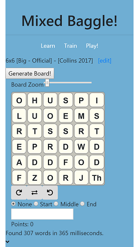

# MixedBaggle

Currently available via the [github pages static host](https://morgulking75.github.io/Mixed-Baggle/).
<table>
    <tr>
        <td></td>
        <td></td>
    </tr>
</table>

## Features
### Current
1. Select Dictionary
2. Select Cube Set
3. Generate board by seed
4. Select Word Length
5. Generating found word list
6. Highlighting word as typed
7. Rotating and flipping board.
8. Scaling board
9. Board shape (limited to rectangular and not bigger than cube set)
10. Word scoring

### Future
1. Timer
2. Opponents
3. Printable view
4. Edit board
5. More official cube sets
6. More dictionaries
7. Word definition
8. Opponents
9. Saving/Loading the game
10. Downloading game to share
11. Online play
12. Better CSS
13. Training setup
14. Predictive word choices
15. Word Heatmaps
16. Statistically proven tips

## Development server

Install dependencies with `npm install`. To run the local site, use `ng serve --open` which will open a browser to `http://localhost:4200/`. The app will automatically reload if you change any of the source files.

## Build

Run `ng build` to build the project. The build artifacts will be stored in the `dist/` directory. Use the `--prod` flag for a production build.

## Running unit tests

Run `ng test` to execute the unit tests via [Karma](https://karma-runner.github.io).

## Running end-to-end tests

Run `ng e2e` to execute the end-to-end tests via [Protractor](http://www.protractortest.org/).
